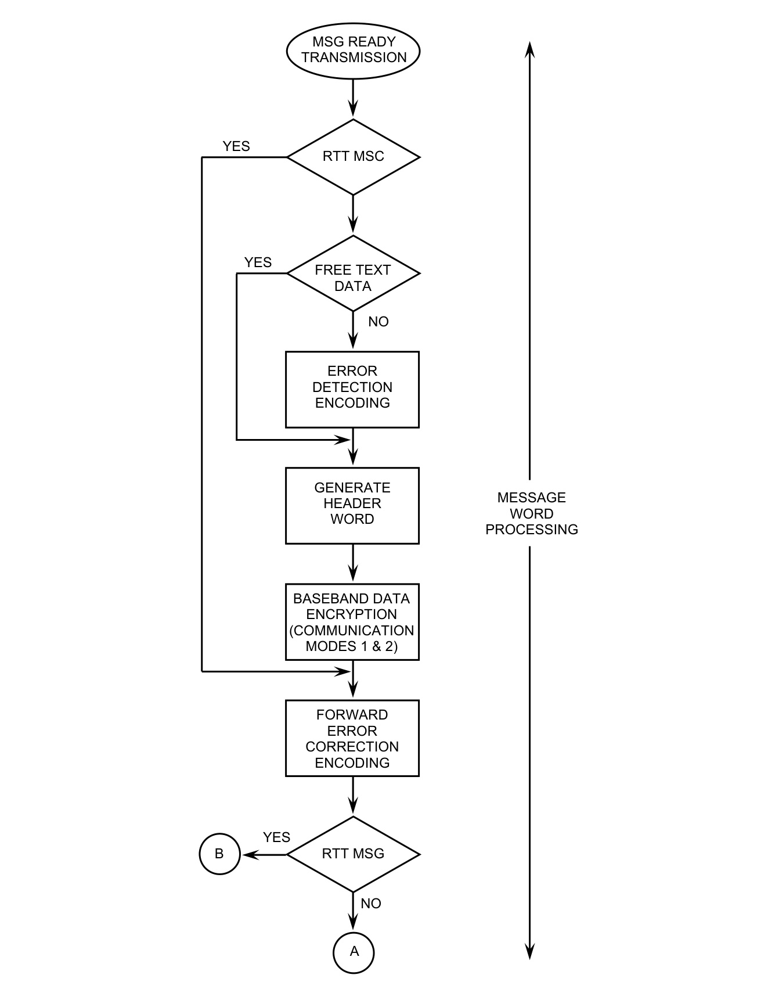
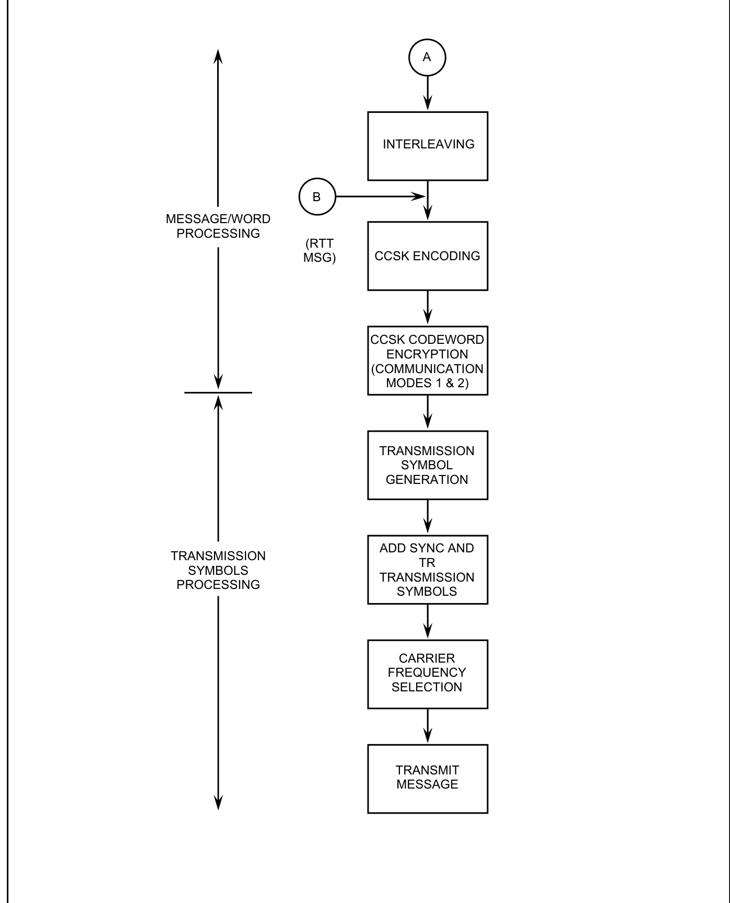
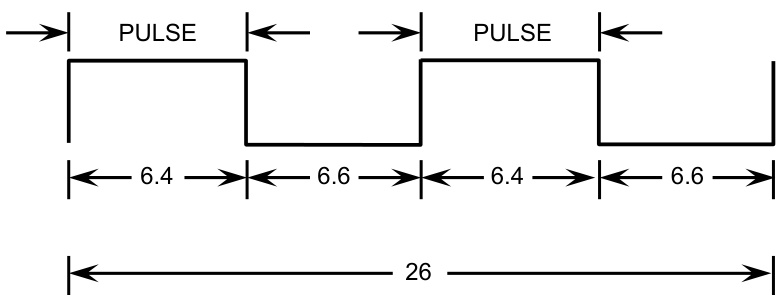
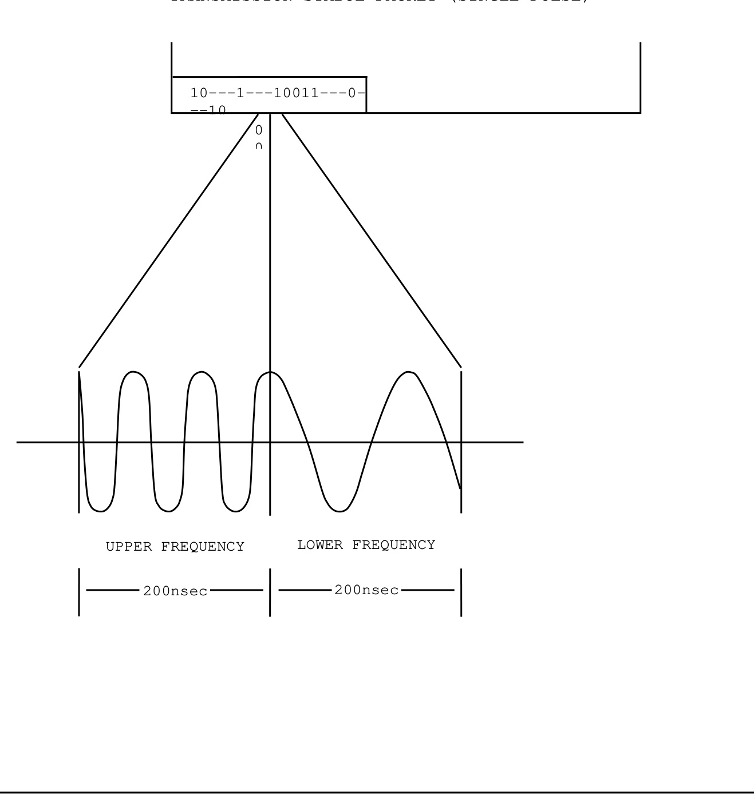

# 3.3.3.2.1 ERROR DETECTION ENCODING  

For fixed and variable format messages, prior to Reed-Solomon encoding, twelve error detection parity bits are to be generated for each block of 210 data bits.  This is done by using a (237, 225) polynomial code having the generating polynomial $\begin{array}{r l r}{{\sf G}\left({\sf X}\right)}&{{}=}&{1{\mathrm{~\boldmath~+~}}{\sf X}^{12}}\end{array}$ where the $"+"$ indicates module-2 addition over each block of 225 bits.  The 225 bits include the 15 bits constituting the Track Number, Source field in the header word and the 210 data bits.  The 12 parity bits are divided into three groups of four bits and a zero bit is added to the beginning of each four bits to fill the parity byte.  The bytes are then combined with 70 data bits to create 75-bit words.  The parity byte appears in bit positions 70 through 74 of each word.  

  
FIGURE 3.3-4.  Transmission Signal Generation (Sheet 1 of 2)  

  
FIGURE 3.3-4.  Transmission Signal Generation (Sheet 2 of 2)  

# 3.3.3.2.2 ENCRYPTION  

In communication modes 1 and 2 baseband data and cyclic code shift keying (CCSK) codewords are encrypted.  

3.3.3.2.3 FORWARD ERROR CORRECTION ENCODING  

The header word, fixed and variable format messages, and selected free-text messages are encoded using a Reed-Solomon code.  The Reed-Solomon code is a 32-ary cyclic block code in the class of generalized Bose-ChaudhuriHocquenguem (BCH) codes.  The Reed-Solomon encoding process converts the 35- bit header word into a (16, 7) Reed-Solomon codeword.  The (16, 7) codeword contains 16 five-bit bytes, of which seven bytes contain data (35 bits of header) and nine bytes contain parity bits.  The 75-bit words comprising messages are individually encoded as (31, 15) Reed-Solomon codewords.  The (31, 15) codeword contains 31 five-bit bytes, of which 15 bytes contain data and 16 bytes contain parity bits.  The (31, 15) and (16, 7) codewords can be encoded and decoded by the same logic.  

# 3.3.3.2.4 INTERLEAVING  

In communication modes 1 and 2, the sequence of five-bit symbols comprising the Reed-Solomon encoded header word and the five-bit symbols comprising the data of the Standard DP and Packed-2 SP message packing structure is transmitted in a predetermined random order.  The header symbols are interleaved among the data symbols.  The header and data symbols of the Packed-2 DP and Packed-4 SP message packing structures are also transmitted in a predetermined random order.  In all four message packing structures, the header symbols are transmitted in the same pulse position.  

# 3.3.3.2.5 CYCLIC CODE SHIFT KEYING ENCODING  

CCSK encoding is applied to the five-bit bytes comprising the Reed-Solomon encoded header word and message(s) after the bytes have been interleaved (if required).  Table 3.3-1 illustrates the relationship between the five-bit bytes and the CCSK codewords.  The 32-bit CCSK codeword for a byte is generated by left-cyclic shifting the initial CCSK codeword (So) n times, where n equals the value (0-31) of the byte being encoded.  

TABLE 3.3-1.  Cyclic Code Shift Keying Codewords   

<html><body><table><tr><td>Five-BitByte</td><td>CCSK Codeword(32 Bits)</td></tr><tr><td>00000</td><td></td></tr><tr><td>00001</td><td>S1 =</td></tr><tr><td>00010</td><td>=11110011101001000010101110110001</td></tr><tr><td></td><td></td></tr><tr><td></td><td></td></tr><tr><td></td><td></td></tr><tr><td>11111</td><td>S31 = 00111110011101001000010101110110</td></tr></table></body></html>

3.3.3.2.6 TRANSMISSION SYMBOL PACKET GENERATION  

The CCSK codewords are converted to one of two types (DP or SP) of transmission symbol packets  (also called symbol packets) illustrated in Figure 3.3-5.  In the DP symbol packet the same CCSK codeword is applied to both pulses.  For communication modes 1 and 2, each pulse of every symbol is transmission encrypted:  the 32-bit CCSK sequence is modified in a way known by all receivers enabling them to recover the CCSK sequence and; therefore, the five data bits it represents.  There is no symbol packet encryption for mode 4.  DP symbol packets are used for the four TR symbols following the synchronization preamble, header words of all transmissions, all symbols of the RTT Interrogation/Reply message, and all data symbols of the Standard DP and Packed-2 DP message packing structures.  The SP symbol is used for the data symbols of the Packed-2 SP and Packed-4 SP message packing structures. The JU may be initialized to transmit only DP message packing structures for any participation group.  The header word indicates the type of message packing structure; therefore, the receiving JU can receive any message without prior knowledge of the message packing structure transmitted.  

  

A.  SINGLE PULSE TRANSMISSION SYMBOL PACKET  

  

B.  DOUBLE PULSE TRANSMISSION SYMBOL PACKET  

ALL VALUES REPRESENT MICROSECONDS  

Each transmitted pulse consists of a burst of carrier frequency.  The frequency is hopped from pulse to pulse in communication mode 1 only.  The transmitted pulse is formed by continuous phase shift modulation (CPSM) of the carrier frequency at a 5-megabit-per-second rate using the 32-bit pulse sequence as the modulating signal.  CPSM, also known as minimum frequency shift keying, can be viewed as phase coherent Frequency Shift Keying (FSK) modulation.  Viewed as an FSK modulation, CPSM is represented by a phase coherent binary FSK signal between two frequencies, $\mathbb{F}_{1}$ and $\operatorname{F}_{2}$ , with separation between them equal to 1/2T, where $\mathrm{~T~}=$ the digit duration of 200 nanoseconds, as illustrated in Figure 3.3-6.  The nth digit is transmitted as the lower frequency if it is the same as the (n-1)st digit.  The higher frequency is transmitted if it differs.  Since noncoherent detection must be employed in the receiver, the frequency transmitted for the first digit of any pulse is arbitrary.  

3.3.3.2.7 CARRIER FREQUENCY SELECTION  

JTIDS/MIDS transmissions occur in the frequency band between 960 and 1,215 MHZ.  In communication modes 2 and 4, all transmissions are made at 969 MHZ. In communication mode 1, spread spectrum modulation is employed to spread the JTIDS/MIDS energy across the band in the 51 discrete frequencies shown in Table 3.3-2.  To prevent interference with the IFF system that also occupies the frequency band, frequencies are excluded in guard regions around the IFF frequencies at 1030 and 1090 MHZ.  The TACAN system also occupies this band, and interference with it is prevented by the spread spectrum modulation that produces JTIDS/MIDS transmissions having low duty cycle and different pulse spacing with respect to any particular TACAN channel.  

# 3.3.4 PARTICIPATION GROUPS  

Messages are sorted into participation groups (PGs)\* and are transmitted in time slots assigned to the PG into which the message has been sorted.  The following paragraphs discuss PG types, time slot and net assignments, and message exchange and PG protocols.  

  
FIGURE 3.3-6.  JTIDS/MIDS Waveform (Continuous Phase Shift Modulation)  

TABLE 3.3-2.  Carrier Frequencies (Communication Mode 1)   

<html><body><table><tr><td>Frequency Number (Fn)</td><td>Frequency (MHZ)</td><td>Frequency Number (Fn)</td><td>Frequency (MHZ)</td><td>Frequency Number (Fn)</td><td>Frequency (MHZ)</td></tr><tr><td>0</td><td>969</td><td>17</td><td>1062</td><td>34</td><td>1158</td></tr><tr><td>1</td><td>972</td><td>18</td><td>1065</td><td>35</td><td>1161</td></tr><tr><td>2</td><td>975</td><td>19</td><td>1113</td><td>36</td><td>1164</td></tr><tr><td>3</td><td>978</td><td>20</td><td>1116</td><td>37</td><td>1167</td></tr><tr><td>4</td><td>981</td><td>21</td><td>1119</td><td>38</td><td>1170</td></tr><tr><td>5</td><td>984</td><td>22</td><td>1122</td><td>39</td><td>1173</td></tr><tr><td>6</td><td>987</td><td>23</td><td>1125</td><td>40</td><td>1176</td></tr><tr><td>7</td><td>990</td><td>24</td><td>1128</td><td>41</td><td>1179</td></tr><tr><td>8</td><td>993</td><td>25</td><td>1131</td><td>42</td><td>1182</td></tr><tr><td>9</td><td>996</td><td>26</td><td>1134</td><td>43</td><td>1185</td></tr><tr><td>10</td><td>999</td><td>27</td><td>1137</td><td>4 4</td><td>1188</td></tr><tr><td>11</td><td>1002</td><td>28</td><td>1140</td><td>45</td><td>1191</td></tr><tr><td>12</td><td>1005</td><td>29</td><td>1143</td><td>46</td><td>1194</td></tr><tr><td>13</td><td>1008</td><td>30</td><td>1146</td><td>47</td><td>1197</td></tr><tr><td>14</td><td>1053</td><td>31</td><td>1149</td><td>48</td><td>1200</td></tr><tr><td>15</td><td>1056</td><td>32</td><td>1152</td><td>49</td><td>1203</td></tr><tr><td>16</td><td>1059</td><td>33</td><td>1155</td><td>50</td><td>1206</td></tr></table></body></html>  

